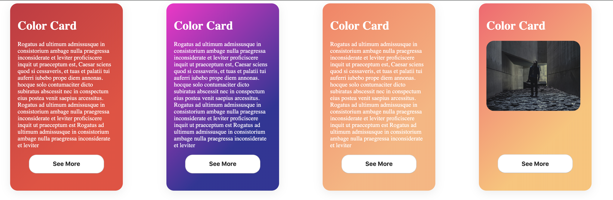

## Color Card

This is a card container for React app.
By default this project provide you different default colors :
```
$blue-to-pink: linear-gradient(-225deg, #3494E6, #EC6EAD 70%);
$orange-to-macaroni: linear-gradient(-225deg, #ff7e5f, #feb47b 70%);
$cosmic-fusion: linear-gradient(-225deg, #ff00cc, #333399 70%);
$fire-watch: linear-gradient(-225deg, #cb2d3e, #ef473a 70%);
$deap-sea-space: linear-gradient(-225deg, #2C3E50, #4CA1AF 70%);
$sweat-morning: linear-gradient(-225deg, #FF5F6D, #FFC371 70%);
$celestial: linear-gradient(-225deg, #C33764, #1D2671 70%);
```

To see more information about the default colors check `src/styles/Colors.scss`

You can easily override the card color by providing the props `color` 
to the component `<ColoredCard />`


### Installation
- `npm install` or `yarn install`
- `npm run start` or `yarn start` 

Or
If you want to import this project like a npm package add :
- `"colored-card": "https://github.com/DDufay/colored-card.git"`
to your package.json

Runs the app in the development mode.<br>
Open [http://localhost:3000](http://localhost:3000) to view it in the browser.

### Demo


### Example code

```
import ColoredCard from 'ColoredCard'; // or from npm : import ColoredCard from 'colored-card';

...

<ColoredCard color='fire-watch'>
    <h1 className="card-title">Color Card</h1>
    <p className="card-text">
       ...
    </p>
    <button className="beauty-btn"> See More</button>
</ColoredCard>
```

`ColoredColor` use children props of react to allow you a free design choice.
Simply wrap your code into `<ColoredCard>...some code...</ColoredCard>`
There is a Demo file `src/components/Demo.jsx`

### Requirement
This only requirement is to use `React`